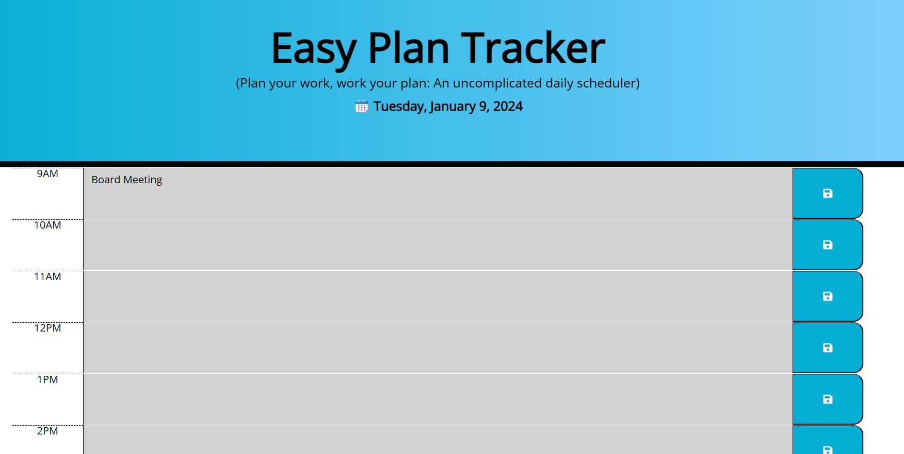

# Easy-Plan-Tracker 📅

Direct Link to Application: [CLICK HERE](https://msalarzon.github.io/Easy-Plan-Tracker/)

## Description

This project is a basic and straightforward calendar app designed to help users manage their daily schedules and events. The app provides a clean and intuitive interface, allowing users to easily navigate and add, edit, or delete events.

- [Installation](#installation)
- [Features](#features)
- [Resources](#resources)
- [License](#license)

## Installation

To run this project locally, follow these steps:

1. Clone the repository to your local machine.
2. Open the `index.html` file in a web browser.
3. Navigate through the calendar, add events, and manage your schedule.

## Features

Key Features:

- Monthly view displaying days and dates.
- Simple event management: add, edit, and delete events.
- User-friendly design for an easy and smooth experience.
- Lightweight and easy to integrate into other projects.

## Resources

- [MDN Web Docs](https://developer.mozilla.org/): An invaluable resource for JavaScript documentation and examples.
- [Stack Overflow](https://stackoverflow.com/): A helpful community for problem-solving and debugging.
- [W3Schools](https://www.w3schools.com/): A comprehensive source for learning and practicing web development concepts.
- [GitHub](https://github.com/): For version control and project hosting.
- [Codecademy](https://www.codecademy.com/): For providing interactive learning experiences.

## License

This project is not licensed and is provided as-is without any warranty or support. You are free to use, modify, and distribute it at your own risk.
